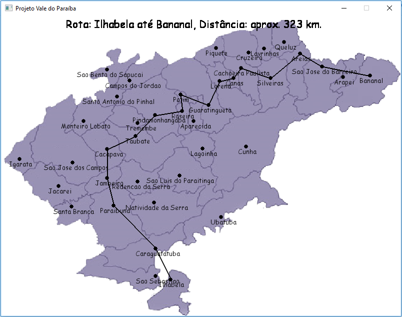
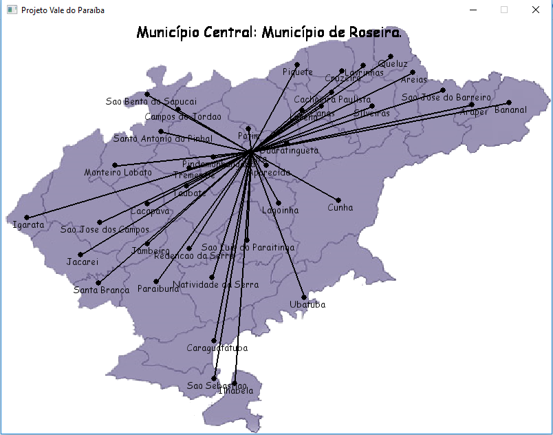

* Introdução / Introduction
  
    O projeto apresenta, através de uma Biblioteca Gráfica, um sistema interativo onde é possível observar as rotas que podem ser realizadas (por estrada) entre dois municípios que se limitam à região do Vale do Paraíba. O número de municípios que fazem parte dessa região é igual a 39.
    
    The project presents, through a Graphic Library, an interactive system where it is possible to observe the routes that can be carried out (by road) between two municipalities that are limited to the Vale do Paraíba region. The number of municipalities that are part of this region is equal to 39.
     
* Objetivo / Objective
  
    O objetivo principal deste projeto é determinar qual é o município do Vale do Paraíba que possui a menor distância média entre todos os outros da região, ou seja, o Município Central do vale.
    
    The main objective of this project is to determine which is the city of Vale do Paraíba that has the lowest average distance among all the others in the region, that is, the Central City of the valley.
     
* Metodologia / Methodology
  
    A parte interativa do sistema foi desenvolvida utilizando a biblioteca gráfica Pygame. Tanto a distância (por estrada) entre os municípios quanto a posição dos pontos do mapa estão armazenados em arquivos .csv, localizados na pasta raiz do projeto, os dados contidos nesses arquivos são lidos pelo programa durante a inicialização do mesmo.
    
    The interactive part of the system was developed using the Pygame graphical library. Both the distance (by road) between the townships and the position of the map points are stored in .csv files, located in the root folder of the project, the data contained in these files are read by the program during the initialization of the same.
     
* Algoritmo de Dijkstra / Dijkstra's Algorithm
  
  O algoritmo de Dijkstra soluciona o problema do caminho mais curto num grafo dirigido ou não dirigido com arestas de peso não negativo, em tempo computacional O([m+n]log n) onde m é o número de arestas e n é o número de vértices. O algoritmo que serve para resolver o mesmo problema em um grafo com pesos negativos é o algoritmo de Bellman-Ford, que possui maior tempo de execução que o Dijkstra.\
   
    O algoritmo considera um conjunto S de menores caminhos, iniciado com um vértice inicial I. A cada passo do algoritmo busca-se nas adjacências dos vértices pertencentes a S aquele vértice com menor distância relativa a I e adiciona-o a S e, então, repetindo os passos até que todos os vértices alcançáveis por I estejam em S. Arestas que ligam vértices já pertencentes a S são desconsideradas.\
  
  The Dijkstra's algorithm solves the shortest path problem in a directed or non-directed graph with non-negative weight edges in computational time O ([m + n] log n) where m is the number of edges en is the number of vertices . The algorithm that serves to solve the same problem in a graph with negative weights is the Bellman-Ford algorithm, which has a longer execution time than Dijkstra.\
   
    The algorithm considers a set S of smallest paths, starting with an initial vertex I. At each step of the algorithm we search in the adjacencies of the vertices belonging to S that vertex with smaller distance relative to I and add it to S and, repeating the steps until all vertices reachable by I are in S. Edges that connect vertices already belonging to S are disregarded.
     
* Algoritmo utilizado para determinar o Município Central / Algorithm used to determine the central city
  
  Neste algoritmo somamos a distância de todas as rotas possíveis a partir de um município origem, o processo se repete com todos os municípios. O Município Central é aquele que, entre todos os outros, possui a menor soma de distâncias, oque significa que o mesmo possui a menor distância média entre todos os outros municípios.\
   
    Utilizamos dois loops para varrer a lista de municípios, os índices i e j são usados para representar os índices do município origem e do município destino, respectivamente. Todas as distâncias são somadas na variável s. A menor soma é armazenada na variável smallest_sum e o município origem correspondente à essa soma é armazenado na variável global central_city. A complexidade deste algoritmo é igual a O(N²), onde N representa o número de municípios.\
    
    In this algorithm we sum the distance of all the possible routes from a city of origin, the process is repeated with all the cities. The Central City is the one that, among all others, has the lowest sum of distances, which means that it has the lowest average distance between all other cities.\
   
    We use two loops to scan the list of cities, indexes i and j are used to represent the indices of the source city and the destination city, respectively. All distances are summed in the variable s. The smallest sum is stored in the smallest_sum variable and the source town corresponding to that sum is stored in the global variable central_city. The complexity of this algorithm is equal to O (N²), where N represents the number of cities.\
     
  
* Instructions:
SPACEBAR            -> Show Central City;
 
LEFT & RIGHT CLICK  -> Select origin and destination cities;
  
  
* Imagens / Images
  

Amostra 1
  

Amostra 2
